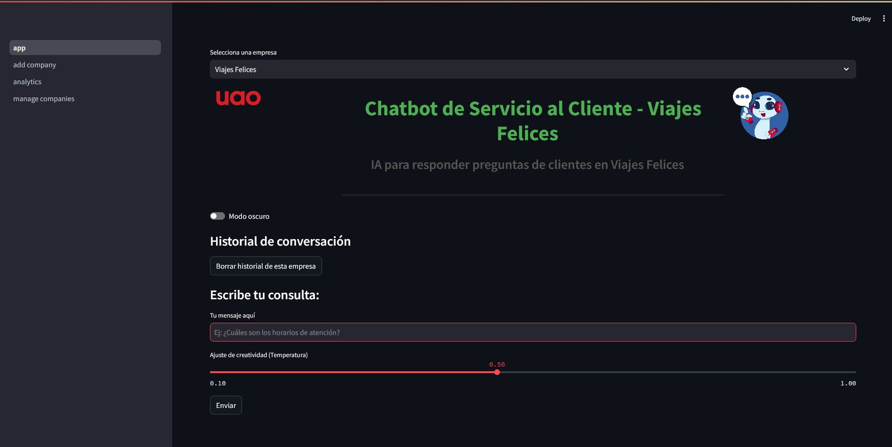
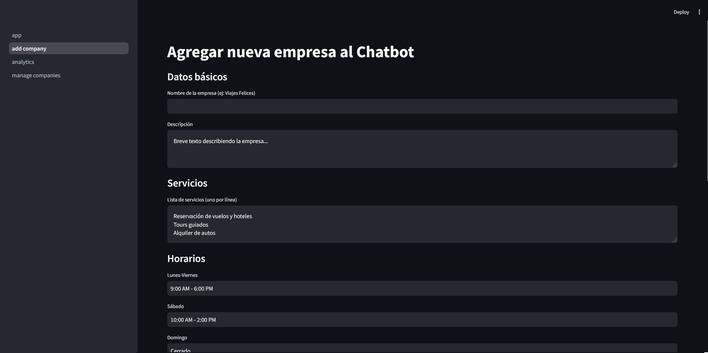
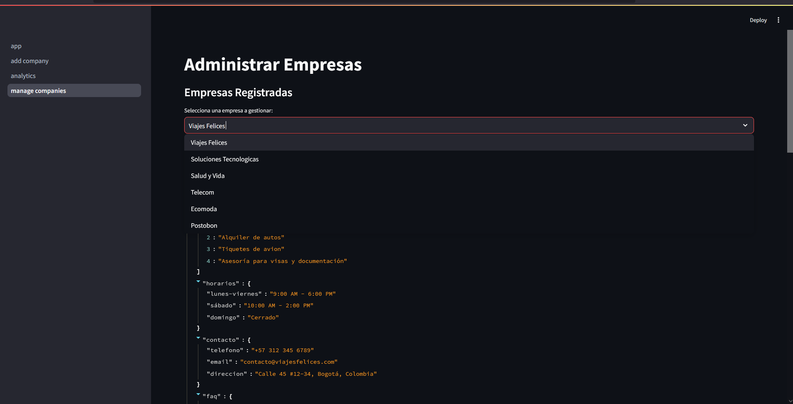
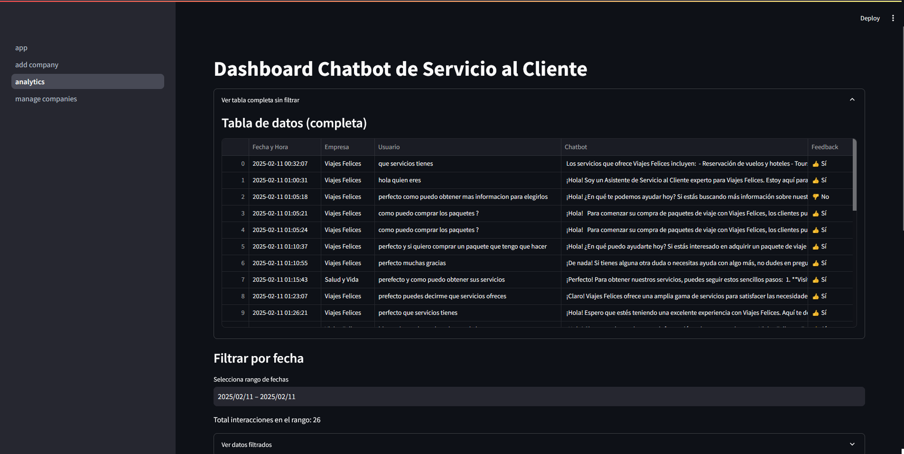
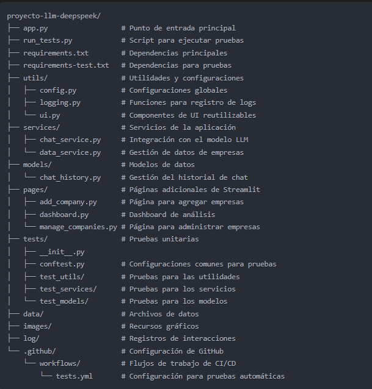

# Especializacion en IA UAO

## Grupo 3

## Integrantes: 

- Pablo Andrés Muñoz Martínez  -   **Código**: 2244676

- Leidy Yasmin Hoyos Parra - **Código**: 2245224 
                
- Johan David Mendoza Vargas  - **Código**: 2245019
                
- Yineth Tatiana Hernández Narvaez  -  **Código**: 2244789 
                
---

# 🤖 Chatbot de Servicio al Cliente con IA

Este es un chatbot inteligente diseñado para **adaptarse a cualquier empresa** y ofrecer un servicio al cliente personalizado. Permite a los usuarios seleccionar una empresa previamente registrada y obtener respuestas automáticas basadas en la información de dicha empresa.

---

## 🚀 Funcionalidades

- 📌 **Selección de Empresa**: Escoge la empresa desde la interfaz para adaptar el chatbot a su contexto.
- 🏢 **Gestión de Empresas**: Agregar y administrar empresas dentro de la plataforma.
- 📊 **Análisis de Datos**: Módulo de analítica para evaluar el rendimiento de las interacciones.
- 💬 **Chatbot Adaptativo**: Se ajusta dinámicamente a la empresa seleccionada.
- 🎨 **Modo Oscuro**: Interfaz moderna y adaptable a diferentes entornos.

---

## 📌 Interfaz

- 📌 **Página Principal**  
  

- 📌 **Página Agregar Empresa**  
  

- 📌 **Página Mantenimiento de Empresas Agregadas**  
  

- 📌 **Página Analítica**  
  

---

## ⚙️ Modelo de IA y Servidor Local

El chatbot utiliza un **modelo de lenguaje alojado localmente**, cargado en **LM Studio** como un servidor API.  

### **Detalles del modelo:**
- **Modelo:** `deepseek-coder-v2-lite-instruct`
- **Fuente:** Descargado de **Hugging Face**.
- **Cuantización:** `Q3_K_L` (optimizado para rendimiento en local).
- **Servidor API:** Ejecutado en **LM Studio** 

El chatbot envía consultas al **servidor local**, el cual procesa las solicitudes y devuelve respuestas basadas en la información de la empresa seleccionada.

---

## 🛠️ Tecnologías Utilizadas

- **Python** 🐍 - Lenguaje de programación principal.
- **Streamlit** 📊 - Framework para construir la interfaz gráfica de usuario.
- **NLTK / SpaCy** 🧠 - Procesamiento del lenguaje natural (si se usa IA avanzada).
- **WordCloud** ☁️ - Generación de nubes de palabras para análisis de textos.
- **Plotly** 📈 - Gráficos interactivos para analítica.

---

## 📂 Arquitectura del Proyecto

La aplicación sigue una arquitectura modular que facilita el mantenimiento y la escalabilidad:

### **Estructura del Proyecto**

 

### **Componentes Principales**

- **App Principal** - Integra todos los componentes y gestiona el flujo de la conversación.
- **Utils**  - Contiene utilidades como configuración, logging y componentes UI reutilizables.
- **Services** - Maneja la comunicación con el LLM y la gestión de datos empresariales.
- **Models** - Define estructuras para el historial de chat y otros datos.
- **Pages** - Páginas adicionales para gestión de empresas y análisis de datos.
- **Tests** - Pruebas unitarias que verifican el correcto funcionamiento de cada componente.
- **GitHub Actions** - Integración continua para ejecutar pruebas automáticamente al realizar cambios.

---

## 🔧 Instalación y Configuración

### 📌 **1. Clonar el repositorio**
```sh
git clone https://github.com/Pabandres85/Proyecto-LLM-deepseek
cd Proyecto-LLM-deepseek

```
### 📌 **2. Crear y activar un entorno virtual**

Ejecuta el siguiente comando según tu sistema operativo:

```sh
python -m venv venv
source venv/bin/activate  # En macOS/Linux
venv\Scripts\activate     # En Windows
```

### 📌 **3. Instalar las dependencias.**
```sh
pip install -r requirements.txt 
```

### 📌 **4. Configurar server local desde LM studio u Ollama.**
cargar modelo descargado previamente al LM studio u Ollama y crear servidor local con API desde ese entorno 
 **Modelo a Cargar:** `deepseek-coder-v2-lite-instruct`
Copiar endpoint dado por el gestor de LLMs y pegarlo en /utils/config.py en la variable **API_URL**

### 📌 **5. Ejecutar la aplicación**
```sh
streamlit run app.py
```
Esto abrirá la aplicación en el navegador.

---

## 🏗️ Cómo Funciona

1. **Selecciona una empresa** desde la lista desplegable en la interfaz.
2. **El chatbot se adapta** automáticamente a la empresa seleccionada.
3. **Puedes gestionar empresas** en la sección de administración.
4. **Consulta el análisis de datos** para evaluar el rendimiento del chatbot.

---
## 🧪 Pruebas Unitarias

Este proyecto incluye pruebas unitarias para verificar el correcto funcionamiento de sus componentes. Las pruebas están organizadas siguiendo la misma estructura modular del proyecto.

### Estructura de pruebas

```
tests/
├── __init__.py
├── conftest.py                    # Configuraciones y fixtures compartidos
├── test_utils/                    # Pruebas para utilidades
├── test_services/                 # Pruebas para servicios
└── test_models/                   # Pruebas para modelos
```

### Ejecución de pruebas

Para ejecutar las pruebas, sigue estos pasos:

1. **Instala las dependencias de prueba**:
   ```sh
   pip install -r requirements.txt
   ```

2. **Ejecuta las pruebas con cobertura**:
   ```sh
   python run_tests.py
   ```
   O alternativamente:
   ```sh
   pytest tests/ -v --cov=utils --cov=services --cov=models --cov-report=term --cov-report=html:coverage_html
   ```

3. **Revisa los resultados**:
   - Los resultados se mostrarán en la terminal
   - Un reporte detallado de cobertura estará disponible en el directorio `coverage_html`

### Cobertura de código

Las pruebas están diseñadas para cubrir:
- Lógica de servicios (comunicación con la API, gestión de datos)
- Modelos de datos (historial de chat)
- Utilidades (configuración, logging, UI)

### Escribir nuevas pruebas

Si agregas nuevas funcionalidades, asegúrate de incluir pruebas correspondientes siguiendo el mismo patrón:

1. Crea un nuevo archivo de prueba en el directorio adecuado (test_utils, test_services, test_models)
2. Utiliza el patrón de nomenclatura `test_*.py` para el archivo
3. Define funciones con prefijo `test_` para cada caso de prueba
4. Utiliza los fixtures definidos en `conftest.py` para configuraciones comunes

---

## 📌 Mejoras Futuras

- 🔹 **Integración con API de CRM** para mejorar la gestión de clientes.
- 🔹 **Integracion con Google Cloud para enviar correos y agregar citas al calendario**.
- 🔹 **Implementación de modelos de IA más avanzados**.

---

## 👨‍💻 Contribuciones

¡Las contribuciones son bienvenidas! Si quieres mejorar el chatbot, abre un **issue** o envía un **pull request**.

## 📄 Licencia

Este proyecto está licenciado bajo la Licencia MIT - consulta el archivo [LICENSE](LICENSE) para obtener más detalles.

📩 **Contacto**: @pabandres85
